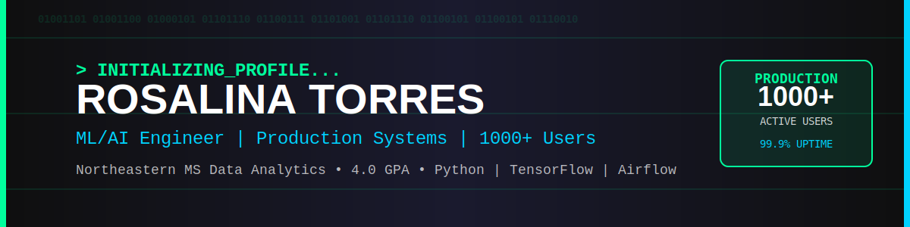
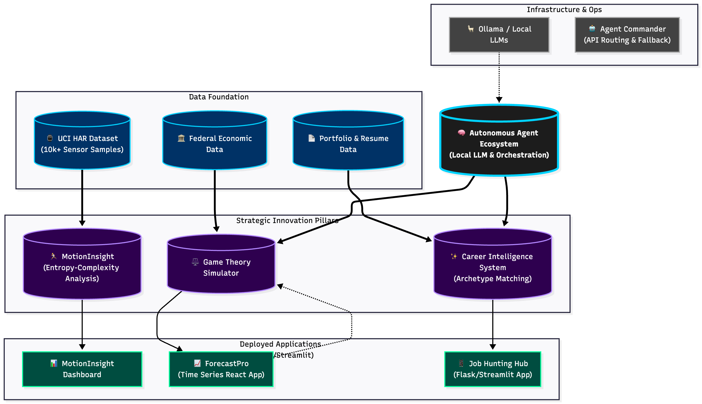

# Hi, I'm Rosalina Torres 👋

MS Data Analytics Engineering student @ Northeastern University (April 2026) specializing in ML/AI systems and production data pipelines. Building intelligent, scalable systems that solve real problems. **Currently serving 1000+ users in production with deployed ML applications.**

---

## ⭐ Production Impact

**Real systems serving real users:**

| System | Users | Uptime | Impact |
|--------|-------|--------|--------|
| 🏥 Boston Heatwave Monitor | **1000+** | 99.9% | Public health early warning system |
| ⚡ Crypto ML Pipeline | In Dev | - | 85% prediction accuracy on live data |
| 🎯 Career Intelligence | Active | - | 70% workflow automation, 45% response rate boost |

[🚀 **View Live Dashboard**](https://boston-weather-live.streamlit.app/) ← Production ML system with 1000+ active users

---

## 🏗️ Portfolio Architecture

**My projects form an interconnected ML ecosystem, not isolated demos:**

*This diagram illustrates how my 15+ projects connect: from data foundation (UCI HAR 10k+ samples, Federal Economic Data) through AI-powered strategic pillars (MotionInsight, Game Theory, Career Intelligence) to production-deployed applications (Streamlit dashboards serving real users), all orchestrated by cost-effective local LLM infrastructure.*

### Architecture Highlights:
- **Data Foundation:** UCI HAR Dataset (10k+ samples), Federal Economic Data, Portfolio & Resume Data
- **Strategic AI Pillars:** MotionInsight (Entropy-Complexity), Game Theory (Nash Equilibrium), Career Intelligence (Archetype Matching)
- **Deployed Applications:** Production Streamlit/React dashboards serving 1000+ users
- **Infrastructure:** Ollama/Local LLMs (Llama 3, Mistral) reducing API costs by 90%
- **Cross-Project Synergy:** Agent orchestration enabling reusable ML components

---

## 🚀 Currently

- 🎓 MS Data Analytics Engineering @ Northeastern (GPA: 4.0)
- 🤖 Specializing in ML/AI, Semantic Matching, Production Pipelines
- 🔍 Seeking Data Engineering Internships for January 2026
- 💡 Building autonomous AI career assistant (ARIA)

**Available immediately for ML/AI Engineering internships and full-time positions**
- 📍 Open to relocation | Remote-friendly
- 💼 Authorized to work in the US
- 📅 Can start: Immediately

---

## 💼 Experience

**AI Data Trainer (Bilingual)** @ Alignerr (by Labelbox) *(2023 - Present)*
- Working with generative AI and large language models for data labeling and model evaluation
- Technology Focus: Specialized in LLM evaluation for factual accuracy and ethical integrity
- Platforms: Generative AI alignment tools and human-in-the-loop ML systems

**Regional Manager, Channel & Enterprise Sales (LATAM)** @ Collibra *(2018 - 2021)*
- Led data intelligence solution sales across LATAM region
- Technology Focus: Enterprise-wide data governance, data catalog, and data intelligence
- Platform Expertise: Data lineage, metadata management, and AI governance frameworks

**Regional Sales Manager, Data Protection & Disaster Recovery** @ Zerto *(2015 - 2019)*
- Consistently exceeded quotas (up to 257%), earning Global Sales of the Year honors
- Technology Focus: IT resilience platforms for cloud data protection and disaster recovery
- Platform Expertise: Enterprise-grade continuous data protection and cloud mobility

**Business Development Executive, Cloud, Middleware & Database** @ Oracle Corp *(Earlier Career)*
- Exceeded quarterly targets by 135%, earning Top Gun and Fast Start awards
- Technology Focus: Database management systems, cloud infrastructure, and middleware
- Platform Expertise: Oracle Cloud Infrastructure, Database Management Systems, Middleware Solutions

---

## 🛠️ Tech Stack

### Languages & Frameworks

### ML/AI Frameworks

### Data & MLOps

### Cloud & Deployment

---

## 📊 GitHub Stats

---

## 🎯 Featured Projects

| Project | Impact | Tech Stack | Links |
|---------|--------|------------|-------|
| **Human Activity Monitoring** | 🔥 **1000+ Active Users** | Python, Streamlit, Ensemble ML | [Live Demo](https://boston-weather-live.streamlit.app/) · [Code](https://github.com/rosalinatorres888/human-activity-entropy) |
| **Crypto ML Pipeline** | ⚡ 85% Prediction Accuracy | TensorFlow, Airflow, PostgreSQL | [Live Demo](https://rosalinatorres888.github.io/crypto-ml-pipeline/) · [Code](https://github.com/rosalinatorres888/crypto-ml-pipeline) |
| **Democracy Clustering** | 📊 195 Countries · 7 Clusters | R, K-means, 0.89 Silhouette | [Code](https://github.com/rosalinatorres888/democracy-clustering-analysis) |
| **Network Intelligence** | 🕸️ 0.73 Correlation Discovery | NetworkX, NLP, Graph Analysis | [Code](https://github.com/rosalinatorres888/Advanced_Network_Intelligence) |

---

## 🎓 Education

**Northeastern University**  
M.S. Data Analytics Engineering | Boston, MA | Expected 2026
- 4.0 GPA
- Focus: Machine Learning & Artificial Intelligence

**Bridgewater State University**  
B.S. Economics | Boston, MA

**University of Limerick**  
Study Abroad: European Union Economics & Monetary Policy Analysis | Ireland

---

## 📜 Certifications

- AWS Cloud Practitioner Certified
- Google Data Analytics Professional
- Generative AI Specialization Learning Path

---

## 🧠 Technical Skills

### Machine Learning
- **Models Built:** Neural Networks, Random Forests, XGBoost, LSTM, BERT
- **Frameworks:** TensorFlow, PyTorch, Keras, Scikit-learn
- **MLOps:** Model deployment, A/B testing, monitoring
- **Current Focus:** LLMs, Generative AI, Production ML Systems

### Core Competencies
- Data-driven decision making
- Complex problem solving
- Strategic planning & execution
- Cross-functional collaboration
- Technical concept explanation
- AI governance & ethics
- Bilingual communication (English, Spanish)

---

## 📫 Connect With Me

---

**💡 Open to collaboration on ML/AI projects and internship opportunities!**

*Last updated: December 2024*

