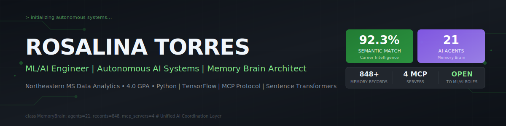
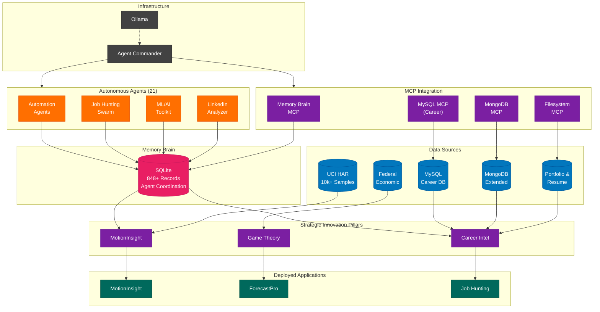

# Hi, I'm Rosalina Torres 👋

MS Data Analytics Engineering student @ Northeastern University (August 2026) specializing in ML/AI systems and production data pipelines. Building intelligent, scalable systems that solve real problems.

---

## 🧠 Portfolio Architecture

**My projects form an interconnected ML ecosystem powered by a unified Memory Brain:**

### Architecture Highlights

| Layer | Components | Purpose |
|-------|------------|---------|
| **🧠 Memory Brain** | SQLite (848+ records) | Central coordination hub for all agents |
| **🔌 MCP Integration** | 4 MCP servers | Claude access to MySQL, MongoDB, SQLite, Filesystem |
| **🤖 Autonomous Agents** | 21 specialized agents | Job hunting, ML/AI toolkit, automation, LinkedIn |
| **🗄️ Data Foundation** | 5 databases | UCI HAR, Federal Economic, Career DB, Portfolio |
| **🚀 Strategic Pillars** | 3 flagship projects | MotionInsight, Game Theory, Career Intelligence |

---

## ⭐ Flagship Projects

| System | Key Metric | Tech Stack | Status |
|--------|------------|------------|--------|
| ✨ **Career Intelligence System** | **92.3% semantic match** | MySQL, MongoDB, Sentence Transformers | Active |
| 🧠 **Memory Brain** | **848+ records, 21 agents** | SQLite, MCP Protocol, Ollama | Active |
| 📊 **LinkedIn Brand Analyzer** | NLP + Network Analysis | SpaCy, NetworkX, PyVis | Active |
| 🤖 **ARIA** | Autonomous Career Assistant | Python, Email Automation, Job APIs | In Development |

---

## 🎯 Featured Projects

### 🏆 Career Intelligence System
> **92.3% semantic matching accuracy** | MySQL + MongoDB + AI-powered resume generation

An intelligent career management platform that matches job opportunities to candidate profiles using advanced NLP and semantic similarity. Features automated resume tailoring, cover letter generation, and application tracking.

**Tech:** Python, MySQL, MongoDB, Sentence Transformers, Streamlit, MCP Integration

[View Project](https://github.com/rosalinatorres888/career-intelligence-system)

---

### 🧠 Memory Brain: Multi-Agent Coordination
> **848+ records** | **21 autonomous agents** | Central orchestration layer

A unified coordination system that connects all my AI agents through a shared SQLite database. Implements Model Context Protocol (MCP) servers for seamless Claude integration across MySQL, MongoDB, and filesystem resources.

**Tech:** Python, SQLite, MCP Protocol, Ollama, Local LLMs

[View Project](https://github.com/rosalinatorres888/memory-brain)

---

### 📊 LinkedIn Brand Analyzer
> NLP-powered brand sentiment & network analysis

Analyzes LinkedIn engagement patterns using NLP (SpaCy, VADER) for sentiment analysis and NetworkX for graph-based network clustering. Identifies which content topics drive high-value engagement from recruiters and industry connections.

**Tech:** Python, SpaCy, NetworkX, PyVis, BERTopic, Streamlit

[View Project](https://github.com/rosalinatorres888/linkedin-brand-analyzer)

---

### 🤖 ARIA - Autonomous Career Assistant
> AI-powered job search automation

An autonomous career assistant that monitors job boards, matches opportunities to my profile, and sends personalized notifications. Integrates with Memory Brain for coordinated job search across multiple platforms.

**Tech:** Python, Email Automation, Job APIs, Memory Brain Integration

[View Project](https://github.com/rosalinatorres888/aria-career-assistant)

---

### 📊 Additional Projects

| Project | Impact | Tech Stack | Links |
|---------|--------|------------|-------|
| **MotionInsight** | Entropy-Complexity Analysis | Python, Signal Processing, Streamlit | [Code](https://github.com/rosalinatorres888/human-activity-entropy) |
| **Democracy Clustering** | 195 Countries · 0.89 Silhouette | R, K-means, PCA | [Code](https://github.com/rosalinatorres888/democracy-clustering-analysis) |
| **Crypto ML Pipeline** | 85% Prediction Accuracy | TensorFlow, Airflow, PostgreSQL | [Code](https://github.com/rosalinatorres888/crypto-ml-pipeline) |
| **Network Intelligence** | 0.73 Correlation Discovery | NetworkX, NLP, Graph Analysis | [Code](https://github.com/rosalinatorres888/Advanced_Network_Intelligence) |

---

## 🚀 Currently

- 🎓 MS Data Analytics Engineering @ Northeastern (GPA: 4.0, Expected August 2026)
- 🤖 Building autonomous AI agents with Memory Brain coordination
- 🔌 Implementing MCP servers for AI-database integration
- 🎯 Career Intelligence System achieving 92.3% semantic matching
- 📝 Graduate Student Ambassador, College of Engineering

**Available for ML/AI Engineering roles**
- 📍 Open to relocation | Remote-friendly
- 💼 Authorized to work in the US
- 📅 Can start: Immediately

---

## 🛠️ Tech Stack

### Languages & Frameworks

### ML/AI Frameworks

### Databases & Infrastructure

### Cloud & Deployment

---

## 📊 GitHub Stats

---

## 💼 Experience

**AI Data Trainer (Bilingual)** @ Alignerr *(2023 - Present)*
- Evaluating LLM responses for factual accuracy, bias detection, and ethical integrity
- Working with generative AI alignment tools and human-in-the-loop ML systems

**Regional Manager, Channel & Enterprise Sales (LATAM)** @ Collibra *(2018 - 2021)*
- Led data intelligence solution sales generating $2.4M+ revenue
- Enterprise data governance, catalog, and AI governance frameworks

**Regional Sales Manager** @ Zerto *(2015 - 2019)*
- Exceeded quotas up to 257%, Global Sales of the Year
- Cloud data protection and disaster recovery platforms

**Business Development Executive** @ Oracle Corp *(Earlier Career)*
- Exceeded targets by 135%, Top Gun and Fast Start awards
- Database management, cloud infrastructure, middleware solutions

---

## 🎓 Education

**Northeastern University** | M.S. Data Analytics Engineering | Boston, MA | Expected August 2026
- 4.0 GPA | Graduate Student Ambassador, College of Engineering
- Focus: Machine Learning, AI Systems, Production Pipelines

**Bridgewater State University** | B.S. Economics | Boston, MA

**University of Limerick** | Study Abroad | Ireland
- European Union Economics & Monetary Policy Analysis

---

## 📜 Certifications

- AWS Cloud Practitioner Certified
- Google Data Analytics Professional
- Generative AI Specialization Learning Path

---

## 📫 Connect With Me

---

**💡 Open to collaboration on ML/AI projects and full-time opportunities!**

*Last updated: January 2026*
