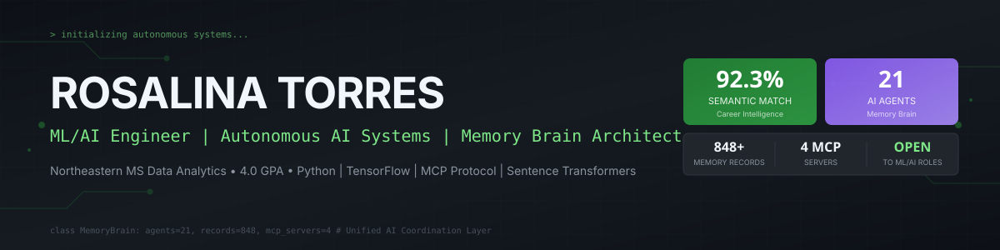

# Hi, I'm Rosalina Torres 👋

MS Data Analytics Engineering @ Northeastern University · completed August 2026 · 3.7 GPA

Specializing in ML/AI systems, agentic architectures, and production data pipelines. Building intelligent, scalable systems that solve real problems — from databases to deployment.

The through-line in my work: every metric I publish links to a committed artifact, and when a number turns out to be wrong, the correction gets published too.

> **Available now** · Open to relocation · Remote-friendly · Authorized to work in the US

---

## 🎯 Featured Projects

### 📈 ROSE ALPHA — AI Investment Dashboard
> **Single-file · 11-tab · live market intelligence terminal** | Claude API + Finnhub + Tavily · [**🔴 Live Demo**](https://rosalinatorres888.github.io/rose-alpha-dashboard/)

A personal AI-powered trading dashboard built around two analyst personas. **Obama** runs agentic market research with live tool use (web search, price feeds, hypothesis testing, scenario modeling). **Trump** predicts chaos event impacts on the portfolio. No build step — just `index.html`.

**Key features:** Macro Regime Detection (classifies Risk-On/Off/Stagflation/Goldilocks every 6h) · Conviction Journal (every AI signal auto-scored vs real price at 7d/30d) · Portfolio Stress Replay (6 historical crashes) · Earnings Watch · Correlation Alerts · Natural Language Trade Journal with bias audit

**Tech:** Vanilla JS/HTML/CSS · Claude API (direct browser) · Finnhub · Tavily · localStorage persistence

[View Project](https://github.com/rosalinatorres888/rose-alpha-dashboard)

---

### 📐 Quant Analytics — Risk & Factor Library
> **Tested Python library · companion to ROSE ALPHA** | Realized risk metrics across 11-asset universe

A production-quality Python package for realized risk and factor analysis across AAPL, NVDA, MSFT, TSLA, GOOGL, SPY, QQQ, VTI, BTC, ETH, and SOL. The methodology behind the Risk tab in ROSE ALPHA — signal generation lives in the dashboard; the math lives here, with full pytest coverage and no network calls in tests.

**Modules:** `volatility` (21d/63d realized vol, VIX context) · `correlation` (rolling Pearson matrix) · `drawdown` (max drawdown, underwater curves) · `factors` (beta to SPY, growth/value tilt, HHI concentration)

**Tech:** Python 3.10+, yfinance, CoinGecko, NumPy, pandas, pytest, Jupyter

[View Project](https://github.com/rosalinatorres888/quant-analytics)

---

### 🤗 MENTOR — Fine-Tuned Mistral-7B Teaching Assistant
> Bilingual (EN/ES) project-based learning tutor · published on Hugging Face

A fine-tuned Mistral-7B model designed for project-based learning pedagogy: teaches by asking, not lecturing. Responds in both English and Spanish. Built around the principle that the best teachers help learners discover answers themselves.

**Tech:** Mistral-7B, fine-tuning, PBL pedagogy, bilingual instruction tuning

[View on Hugging Face](https://huggingface.co/spanishrose/mentor-mistral-7b-pbl)

---

### 🏆 Career Intelligence System
> Semantic job–candidate matching · built ground-up: database architecture → semantic layer → UI

An intelligent career management platform that matches job opportunities to candidate profiles using NLP and semantic similarity. I designed and built every layer: MySQL conceptual + physical database design, MongoDB for extended candidate data, SQLite for coordination, the sentence-transformer matching pipeline, and the Streamlit interface. Features automated resume tailoring, cover letter generation, and application tracking. Formal accuracy benchmarking against labeled matches is on the roadmap — until then, no number.

**Tech:** Python, MySQL (architecture + conceptual design), MongoDB, SQLite, Sentence Transformers, Streamlit, MCP Integration

[View Project](https://github.com/rosalinatorres888/career-intelligence-system)

---

### 🧠 Memory Brain: Multi-Agent Coordination
> **848+ records** | **21 autonomous agents** | Central orchestration layer · private system

A unified coordination system that connects all my AI agents through a shared SQLite database. Implements Model Context Protocol (MCP) servers for seamless Claude integration across MySQL, MongoDB, and filesystem resources. The repository is private (it coordinates live personal agents) — architecture write-up available on request.

**Tech:** Python, SQLite, MCP Protocol, Ollama, Local LLMs

---

### 📊 LinkedIn Brand Analyzer
> NLP-powered brand sentiment & network analysis

Analyzes LinkedIn engagement patterns using NLP (SpaCy, VADER) for sentiment analysis and NetworkX for graph-based network clustering. Identifies which content topics drive high-value engagement from recruiters and industry connections.

**Tech:** Python, SpaCy, NetworkX, PyVis, BERTopic, Streamlit

[View Project](https://github.com/rosalinatorres888/linkedin-brand-analyzer)

---

### 🤖 ARIA — Autonomous Career Assistant
> Multi-agent autonomous workflow built on top of the Career Intelligence System

Where CIS provides the foundational data + semantic-matching platform, ARIA adds the autonomous agent layer: continuously monitoring job boards, matching opportunities against the CIS knowledge base, generating tailored outreach, and triggering notifications without human intervention. Integrates with Memory Brain for coordinated state across runs.

**Tech:** Python, Memory Brain coordination, Job APIs, Email Automation, agent orchestration

[View Project](https://github.com/rosalinatorres888/aria-career-assistant)

---

### 💸 Multi-Agent LLM Router
> Local-first, complexity-based routing · design prototype

Routing system that classifies query complexity and routes accordingly: simple queries stay local (Ollama), complex queries escalate to cloud models. The design goal is cutting inference spend without sacrificing quality on hard tasks; measured cost benchmarks are pending, so no savings number is claimed here yet.

**Tech:** Python, local-first LLMs (Ollama), complexity classification, fallback architecture

[View Project](https://github.com/rosalinatorres888/multi-agent-llm-router)

---

## 🔬 Research & Evaluation Work

Every number below traces to a committed results file in the linked repo.

| Project | What the evidence shows | Links |
|---------|------------------------|-------|
| **VerifAI** — bilingual (EN/ES) fact-checking system | From-scratch 6.3M-parameter transformer + RAG pipeline. Found and publicly corrected 26.7% test-set contamination in my own benchmark (macro-F1 0.365 → 0.331); RAGAS faithfulness 0.776 against a 0.75 target pre-committed in code | [Code](https://github.com/rosalinatorres888/verif-ai) · [Write-up](https://rosalina.sites.northeastern.edu/2026/07/03/verifai/) |
| **Boston Celtics CoSQL** — conversational text-to-SQL (IE7500 group project) | Authored the 139-pair annotated corpus (99.3% execution rate, dual-auditor QA) and the few-shot NL2SQL pipeline: 88.5% execution accuracy on a leakage-free held-out set, strict cross-schema stress tests (31.8%), and a public correction of an earlier validity-only figure | [Group repo](https://github.com/rosalinatorres888/cosql-nba-spatial) · [My pipeline](https://github.com/rosalinatorres888/nba-cosql-spatial-pipeline) |
| **Slack behavioral segmentation** — research methods release | Unsupervised segmentation of an online graduate learning community (n=116): PCA → K-Means, silhouette-selected k=6. Ships the full pipeline plus a synthetic-data demo — and no data, by design: DATA.md documents the consent, program-data, and FERPA reasoning | [Code](https://github.com/rosalinatorres888/slack-behavioral-segmentation) |
| **aria-dbt** — analytics warehouse with data contracts | 46/46 layered dbt tests passing in CI: source contracts, referential integrity, range and invariant checks | [Code](https://github.com/rosalinatorres888/aria-dbt) |
| **hn-etl-pipeline** — orchestrated ETL | Dockerized Airflow producing Hive-partitioned NDJSON on S3-compatible storage (LocalStack), with a Glue/Athena query layer. 9 verified DAG runs and a 12-case pytest suite | [Code](https://github.com/rosalinatorres888/hn-etl-pipeline) |
| **Democracy clustering** — unsupervised analysis | 167 countries on the EIU Democracy Index: K-means and hierarchical methods, silhouette model selection, bootstrap stability ARI 0.583 ± 0.091 | [Code](https://github.com/rosalinatorres888/democracy-clustering-analysis) |

**Honest-experiments series** — four repos where the committed outputs are the point, negative results included: [cross-entropy-vs-mse](https://github.com/rosalinatorres888/cross-entropy-vs-mse) (MSE out-calibrated cross-entropy on ECE, 0.132 vs 0.180 — but CE escaped 10/10 confidently-wrong predictions), [word2vec-grid-search](https://github.com/rosalinatorres888/word2vec-grid-search) (my embeddings hit 10% where GloVe hit 63%; that gap is the finding), [nlp-failure-modes](https://github.com/rosalinatorres888/nlp-failure-modes), [gradient-descent-experiments](https://github.com/rosalinatorres888/gradient-descent-experiments)

**Live tools:** [Critical-path planner](https://critical-path-planner.netlify.app) — CPM with forward/backward pass and float · [HAR analytics dashboard](https://rosalinatorres888.github.io/har-3d-analytics-dashboard/) — entropy-based movement analysis in Three.js/D3

**More repos:** [crypto-ml-pipeline](https://github.com/rosalinatorres888/crypto-ml-pipeline) (CoinGecko ETL + Random Forest baseline) · [Advanced_Network_Intelligence](https://github.com/rosalinatorres888/Advanced_Network_Intelligence) (graph analysis)

---

## ✍️ Writing

I write about my own failure modes: [The Accuracy Score That Lied to Me](https://rosalina.sites.northeastern.edu/the-accuracy-score-that-lied-to-me/) · [My Model Never Learned the Word "Athens"](https://rosalina.sites.northeastern.edu/my-model-never-learned-the-word-athens/) · [more on the blog](https://rosalina.sites.northeastern.edu)

---

## ⭐ Flagship Systems at a Glance

| System | Highlight | Tech Stack | Status |
|--------|-----------|------------|--------|
| 📈 **ROSE ALPHA Dashboard** | **11 tabs · live AI analyst · regime detection** · single HTML file | Vanilla JS, Claude API, Finnhub, Tavily | Active |
| 📐 **Quant Analytics** | **Realized risk library · companion to ROSE ALPHA** · tested Python package | Python, yfinance, NumPy, pytest | Active |
| 🤗 **MENTOR (Mistral-7B)** | **Fine-tuned bilingual EN/ES tutor** · published on Hugging Face | Mistral-7B, PBL pedagogy, fine-tuning | Published |
| ✨ **Career Intelligence System** | **Semantic matching platform** · built ground-up | MySQL, MongoDB, SQLite, Sentence Transformers, Streamlit | Active |
| 🤖 **ARIA** | **Autonomous multi-agent workflow** built on CIS | Python, Memory Brain, Job APIs, Email Automation | Active |
| 🧠 **Memory Brain** | **848+ records, 21 agents** · private system | SQLite, MCP Protocol, Ollama | Active |
| 💸 **Multi-Agent LLM Router** | **Local-first routing** · design prototype | Python, local-first LLMs, complexity-based routing | Prototype |
| 📊 **LinkedIn Brand Analyzer** | NLP + Network Analysis | SpaCy, NetworkX, PyVis | Active |

---

## 🚀 Currently

- 🎓 M.S. Data Analytics Engineering @ Northeastern — completed August 2026 (GPA 3.7)
- 📝 Graduate Student Ambassador, College of Engineering
- 🤖 Autonomous AI agents with Memory Brain coordination
- 🔌 MCP servers for AI-database integration

---

**💼 Open to ML/AI Engineering roles · Available immediately · Open to relocation · Remote-friendly · Authorized to work in the US**

---

## 🛠️ Tech Stack

### Languages & Frameworks

### ML/AI Frameworks

### Data & Pipelines

### Cloud & Deployment

---

## 📊 GitHub Stats

---

## 💼 Experience

**AI Data Trainer (Bilingual)** @ Alignerr *(2025 – present)*
- RLHF annotation and preference ranking for frontier LLM training pipelines
- Bilingual (EN/ES) evaluation of model outputs for factual accuracy, bias, and safety across reasoning and coding tasks
- Human-in-the-loop feedback specialist on alignment tooling used in production model iterations

**Regional Manager, Channel & Enterprise Sales (LATAM)** @ Collibra
- Led data intelligence solution sales across LATAM enterprise accounts
- Enterprise data governance, catalog, and AI governance frameworks

**Regional Sales Manager** @ Zerto
- Solo-owned the LATAM territory; MVP Global Salesperson of the Year
- Cloud data protection and disaster recovery platforms

**Business Development Executive** @ Oracle Corp
- Top Gun and Fast Start awards
- Database management, cloud infrastructure, middleware solutions

*Full role dates on [LinkedIn](https://linkedin.com/in/rosalina-torres).*

---

## 🎓 Education

**Northeastern University** | M.S. Data Analytics Engineering | Boston, MA | Completed August 2026
- 3.7 GPA | Graduate Student Ambassador, College of Engineering
- Focus: Machine Learning, AI Systems, Production Pipelines

**Bridgewater State University** | B.S. Economics | Boston, MA

**University of Limerick** | Study Abroad | Ireland
- European Union Economics & Monetary Policy Analysis

---

## 📜 Certifications

- AWS Cloud Practitioner Certified
- Google Data Analytics Professional
- Generative AI Specialization Learning Path

---

## 📫 Connect With Me

---

**💡 Open to collaboration on ML/AI projects and full-time opportunities!**

*Last updated: August 2026*
