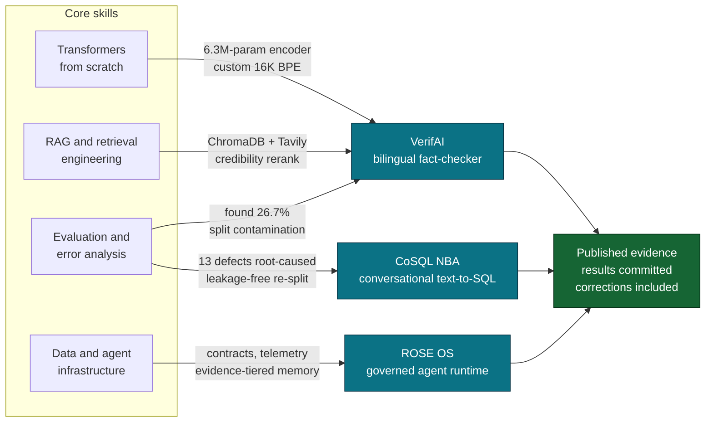

<h1 align="center">Rosalina Torres</h1>

<b>AI &amp; Machine Learning Engineer</b> · trustworthy ML systems, evaluation, and agentic architectures

  
  
  

  
  
  
  
  
  

---

I build ML systems and then try to break them in public. Every metric below links to a committed artifact in the repo that produced it. When a number turns out to be wrong — contaminated splits, a leaky evaluation, an accuracy score measuring the wrong thing — the correction gets published next to the original, and the old checkpoint stays in the repo so the comparison is auditable.

Twelve years in enterprise data, governance, and cloud before this. That's why I care more about whether a number survives contact with production than whether it looks good on a slide.

**Open to ML/AI Engineer, Research Engineer, and Forward-Deployed AI Engineer roles.**

---

## How the work connects

```mermaid
flowchart LR
  subgraph SKILLS["Core skills"]
    A["Transformers<br/>from scratch"]
    B["RAG and retrieval<br/>engineering"]
    C["Evaluation and<br/>error analysis"]
    D["Data and agent<br/>infrastructure"]
  end

  A -->|"6.3M-param encoder<br/>custom 16K BPE"| V["VerifAI<br/>bilingual fact-checker"]
  B -->|"ChromaDB + Tavily<br/>credibility rerank"| V
  C -->|"found 26.7%<br/>split contamination"| V
  C -->|"13 defects root-caused<br/>leakage-free re-split"| Q["CoSQL NBA<br/>conversational text-to-SQL"]
  D -->|"contracts, telemetry<br/>evidence-tiered memory"| R["ROSE OS<br/>governed agent runtime"]

  V --> E["Published evidence<br/>results committed<br/>corrections included"]
  Q --> E
  R --> E

  style V fill:#0B7285,stroke:#083344,color:#ffffff
  style Q fill:#0B7285,stroke:#083344,color:#ffffff
  style R fill:#0B7285,stroke:#083344,color:#ffffff
  style E fill:#166534,stroke:#052e16,color:#ffffff
```

---

## 🔬 Reliability Lab — [rosalinalabs.com/lab](https://rosalinalabs.com/lab)

  
  
  

The argument I keep making in writing is that reliability is a chain, not a score. The Lab is that argument you can click on: seven instruments, each isolating **one** condition of a reliable AI system so you can change it and watch what breaks.

Start with the **Evidence Inspector** — it opens on a claim the model is 92% confident about, with 0% evidence coverage. That gap is the whole thesis.

| # | Instrument | What it isolates |
|---|---|---|
| 01 | **Evidence Inspector** | Can every important claim be traced to a trustworthy source? |
| 02 | **Hallucination Simulator** | Remove grounding and watch confident errors emerge |
| 03 | **Retrieval Explorer** | How information gets found, ranked, and actually used |
| 04 | **Memory Visualizer** | What the system remembers, what it forgets, and why that matters |
| 05 | **Governance Console** | Policy testing — how risky requests get intercepted |
| 06 | **Evaluation Bench** | Measuring across dimensions, because accuracy is not enough |
| 07 | **Human Review Station** | Review, annotate, and improve an AI-generated answer |

## Anchor projects

### VerifAI — bilingual (EN/ES) misinformation classifier + RAG fact-checker

    

A transformer encoder and a 16K BPE tokenizer built from scratch — no pretrained weights — with English/Spanish language-ID embeddings, trained on a 37.6K-claim corpus. The RAG layer does language detection, ChromaDB retrieval with a Tavily web fallback, and a credibility-weighted rerank before it returns a grounded verdict in the input language.

The part I'd actually want to talk about in an interview: late in the project I audited my own splits and found **26.7% train/test overlap**. Fixing it dropped test macro-F1 from **0.3647 to 0.3313** — the leak had been inflating my headline number by 10.1%. I rebuilt the splits, republished the lower number, and kept the contaminated checkpoint in the repo so both runs stay comparable. RAGAS faithfulness came in at 0.776 against a 0.75 threshold committed in code *before* the run.

The Spanish side is the honest weak spot and I say so in the repo: 991 Spanish training rows against 36,617 English. Same claim, same meaning, 72% confidence in English and 57% in Spanish.

[**Repo**](https://github.com/rosalinatorres888/verif-ai) · [**Write-up**](https://rosalinalabs.com/writing/verifai-teaching-ai-to-check-its-sources)

---

### CoSQL NBA — conversational text-to-SQL over spatial data

   

Multi-turn basketball questions in plain English resolved into executable PostgreSQL, carrying coreference across turns ("what about only *his* made shots?"). I authored the 139-pair Wizard-of-Oz annotation corpus (99.3% execution rate, dual-auditor QA, Cohen's κ 98.6%) and built the few-shot NL2SQL pipeline.

**88.5% execution accuracy** on a conversation-level, leakage-free held-out split. I report the strict cross-schema number too — **31.8%** — because that gap is the finding, not a blemish. An earlier version of this project reported a much higher figure that turned out to be SQL *validity*, not execution accuracy; the correction is public in the repo.

Thirteen defects root-caused along the way. My favorite: `nba_api` stored shot coordinates in tenths-of-feet and shot distance in whole feet, in the same table, undocumented. Every zone query silently returned zero rows.

[**My pipeline**](https://github.com/rosalinatorres888/nba-cosql-spatial-pipeline) · [**Group repo (3 architectures compared)**](https://github.com/rosalinatorres888/cosql-nba-spatial) · [**Live annotation tool**](https://nba-cosql-spatial-annotation-tool.netlify.app/)

---

### ROSE OS — agent runtime with a governed memory core

     

The production system behind the Reliability Lab's Governance Console and Memory Visualizer. A multi-agent runtime where every agent has a declared contract: a registry, explicit capability grants, and missions that stop at an approval gate rather than executing straight through.

Underneath it is the **Memory Core** — a knowledge graph where every fact carries an evidence tier (`candidate` → `validated` → `canonical`) and a provenance edge back to the artifact that justifies it. Agents can read canonical facts; promoting a claim to canonical requires the evidence to exist. That constraint is the entire point: it makes "the agent made it up" a structurally detectable state rather than something you notice later.

Guardrails are enforced, not documented — tool-use enforcement is regression-tested, memory writes are attributed to the runner that made them, and failures are loud by design.

The runtime stays private — it holds real career and contact data. But the layer that makes it defensible is public and runnable: **[rose-os-evidence-layer](https://github.com/rosalinatorres888/rose-os-evidence-layer)** ships the tier ladder, the provenance graph, the contract registry, and the export gate, with 18 tests that cover the *refusal* paths rather than only the happy ones. No real data — a synthetic 21-entity graph exercises every rung.

[**Evidence layer repo**](https://github.com/rosalinatorres888/rose-os-evidence-layer) · [**Interactive Memory Core demo**](https://rosalinatorres888.github.io/rose-os-evidence-layer/) — try promoting a claim with no artifact behind it; the refusal is the point

---

## Evidence table

Every number traces to a committed results file in the linked repo.

| Project | What the evidence shows | Link |
|---|---|---|
| **Slack behavioral segmentation** | Unsupervised segmentation of a graduate learning community (n=116, 162 channel-months): PCA → K-Means, silhouette-selected k=6, t-SNE projection. Six archetypes, presented at Northeastern's Cutting EDGE conference. Ships the pipeline and a synthetic-data demo — and no real data, by design: `DATA.md` documents the consent and FERPA reasoning | [Code](https://github.com/rosalinatorres888/slack-behavioral-segmentation) |
| **aria-dbt** | Analytics warehouse with data contracts — staging/marts layering, dimensional modeling (fact + conformed dimension + analytics mart), 46/46 schema tests passing in CI. DuckDB-portable to Snowflake | [Code](https://github.com/rosalinatorres888/aria-dbt) |
| **hn-etl-pipeline** | Dockerized Airflow producing Hive-partitioned NDJSON on S3-compatible storage (LocalStack), with a Glue/Athena query layer. 9 verified DAG runs, 12-case pytest suite | [Code](https://github.com/rosalinatorres888/hn-etl-pipeline) |
| **Democracy clustering** | 167 countries on the EIU Democracy Index — K-means and hierarchical, silhouette model selection, bootstrap stability ARI 0.583 ± 0.091 | [Code](https://github.com/rosalinatorres888/democracy-clustering-analysis) · [Write-up](https://rosalinalabs.com/writing/democracy-in-data) |
| **Human activity entropy** | Information-theoretic behavioral classification: permutation entropy and statistical complexity features over noisy multi-channel sensor data. 87.8% test accuracy — reported alongside 68.3% cross-validation and 27.5% cross-dataset generalization, because the third number is the one that matters | [Live dashboard](https://rosalinatorres888.github.io/har-3d-analytics-dashboard/) |
| **rose-os-evidence-layer** | The governance layer from ROSE OS, public and runnable: four-rung evidence ladder, typed provenance edges where only `justified_by` licenses canonical, capability contracts that raise instead of warn, and an export gate that refuses rather than silently redacting. 18 tests, synthetic data only | [Code](https://github.com/rosalinatorres888/rose-os-evidence-layer) · [Demo](https://rosalinatorres888.github.io/rose-os-evidence-layer/) |
| **Multi-model router** | Claude, ChatGPT, Gemini and Perplexity treated as stateless specialists behind a Neo4j graph trace ledger — memory lives in the system, not the models. 15 tests | [Code](https://github.com/rosalinatorres888/multi-model-router) |

### Honest-experiments series

Four repos where the committed outputs are the point, negative results included.

| Study | The finding | |
|---|---|---|
| **Cross-entropy vs MSE** | Pure-NumPy loss study. MSE out-calibrated cross-entropy on ECE (0.132 vs 0.180) — but CE escaped 10/10 confidently-wrong predictions that MSE stayed stuck on | [Code](https://github.com/rosalinatorres888/cross-entropy-vs-mse) · [Write-up](https://rosalinalabs.com/writing/the-mistake-my-network-refused-to-fix) |
| **Word2Vec grid search** | 27 runs against a GloVe baseline. My embeddings hit 10% where GloVe hit 63%. That gap is the result | [Code](https://github.com/rosalinatorres888/word2vec-grid-search) · [Write-up](https://rosalinalabs.com/writing/my-model-never-learned-the-word-athens) |
| **Gradient descent experiments** | SGD, momentum, and Adam failure modes — including the fast algorithm that ran 370× slower | [Code](https://github.com/rosalinatorres888/gradient-descent-experiments) · [Write-up](https://rosalinalabs.com/writing/the-fast-algorithm-that-was-370-times-slower) |
| **NLP failure modes** | Where standard pipelines quietly break — the run where "Washington" stopped being a person | [Code](https://github.com/rosalinatorres888/nlp-failure-modes) · [Write-up](https://rosalinalabs.com/writing/when-washington-stopped-being-a-person) |

---

## Other builds

| System | What it is | Stack | Status |
|---|---|---|---|
| 📈 [**ROSE ALPHA**](https://github.com/rosalinatorres888/rose-alpha-dashboard) | 11-tab market intelligence terminal in a single HTML file. Macro regime detection, a conviction journal that auto-scores every AI signal against real price at 7d/30d, portfolio stress replay across 6 historical crashes | Vanilla JS, Claude API, Finnhub, Tavily | [Live](https://rosalinatorres888.github.io/rose-alpha-dashboard/) |
| 📐 [**Quant Analytics**](https://github.com/rosalinatorres888/quant-analytics) | The math behind ROSE ALPHA's risk tab, as a tested package: realized vol, rolling correlation, drawdown, factor tilt across an 11-asset universe. No network calls in tests | Python, NumPy, pandas, pytest | Active |
| 📊 [**LinkedIn Brand Analyzer**](https://github.com/rosalinatorres888/linkedin-brand-analyzer) | Engagement analysis with SpaCy + VADER sentiment and NetworkX graph clustering | SpaCy, NetworkX, BERTopic, Streamlit | Active |
| 🗂️ [**Career Intelligence System**](https://github.com/rosalinatorres888/career-intelligence-system) | Semantic job-to-candidate matching, built ground-up: MySQL conceptual and physical design, MongoDB for extended profiles, a sentence-transformer matching pipeline, Streamlit UI. No accuracy figure on purpose — benchmarking against labeled matches does not exist yet | MySQL, MongoDB, Sentence Transformers | Active |
| 🗓️ [**Critical-path planner**](https://critical-path-planner.netlify.app) | CPM with forward/backward pass and float computation | JS | Live |

---

## Writing

I write about my own failure modes, at [**rosalinalabs.com/writing**](https://rosalinalabs.com/writing).

[The Accuracy Score That Lied to Me](https://rosalinalabs.com/writing/the-accuracy-score-that-lied-to-me) · [VerifAI: Teaching AI to Check Its Sources](https://rosalinalabs.com/writing/verifai-teaching-ai-to-check-its-sources) · [My Model Never Learned the Word "Athens"](https://rosalinalabs.com/writing/my-model-never-learned-the-word-athens) · [When AI Learns to Doubt Itself, Medicine Gets Safer](https://rosalinalabs.com/writing/when-ai-learns-to-doubt-itself-medicine-gets-safer)

---

## Experience

**Graduate Student Ambassador** — Northeastern University, College of Engineering (EDGE) · *Jan 2026 – present*
Behavioral segmentation of graduate-student engagement (n=116, 162 channel-months) using PCA, K-Means, and t-SNE. Identified six archetypes and presented the resulting content and mentorship roadmap at Northeastern's Cutting EDGE conference.

**Spanish AI Data Trainer** — Alignerr (by Labelbox) · *Jan 2025 – present*
Evaluate generative-AI and LLM datasets for factual accuracy, bias, ethics, and multilingual quality. Improved multilingual output accuracy by 20%; built embedding-based networks exceeding 85% classification accuracy.

**Manager, Partnership Alliances & Channel Sales — Latin America** — Collibra · *2021 – 2023*
Directed Data Intelligence Cloud strategy for enterprise governance, metadata, lineage, privacy, and compliance. Partnered with AWS, Google Cloud, Snowflake, and Databricks while delivering double-digit year-over-year growth.

**Earlier enterprise technology roles** — Zerto (HPE), Oracle, Dell EMC, TripAdvisor · *2011 – 2021*
Cloud, disaster-recovery, data-platform, pricing, and analytics engagements. 257% of quota at Zerto, $20M+ pipeline built at Oracle, and TripAdvisor's #1 global sales manager.

*Full dates on [LinkedIn](https://linkedin.com/in/rosalina-torres).*

---

## Education & credentials

**M.S. Data Analytics Engineering** — Northeastern University, College of Engineering · Completed August 2026 · **GPA 3.78**
Coursework: Machine Learning & Data Analytics · Statistical Learning for Engineering · Applied NLP in Engineering · Neural Networks & Deep Learning · Generative AI · Data Management for Analytics · Deterministic Operations Research

**B.S. Economics** — Bridgewater State University, Bridgewater, MA
Study abroad: University of Limerick, Ireland — EU economics and monetary policy

**Certification:** [Neo4j Certified Professional](https://graphacademy.neo4j.com/c/8f3c76f9-4b9a-4d99-8365-bd9620169cb2/) — Neo4j GraphAcademy, August 2026 · credential `8f3c76f9`

**Coursework:** AWS Cloud Practitioner Essentials · AWS Fundamentals: Going Cloud-Native · AWS Fundamentals: Addressing Security Risk · Google Data Analytics: Foundations

**Press:** Featured by Northeastern University Online, *"Career Change: Data Analytics Engineering."* Co-presenter, Northeastern Cutting EDGE Conference, May 2026.

---

## Stack

**Modeling**    

**Languages**    

**Data & pipelines**      

**Infra & serving**     

**Evaluation** — cross-validation, ablations, error analysis, calibration/ECE, RAGAS, dimensionality reduction, reproducible research

---

  
  

---

  <b>Open to ML/AI Engineer, Research Engineer, and Forward-Deployed AI Engineer roles</b> 
  Greater Boston · open to relocation · remote-friendly · authorized to work in the US

  
  
  

